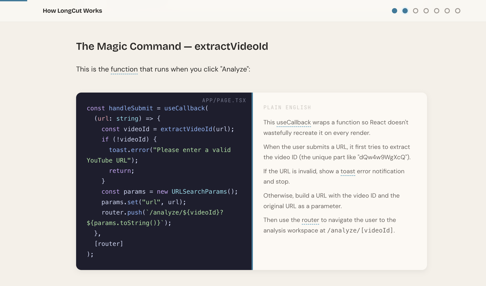
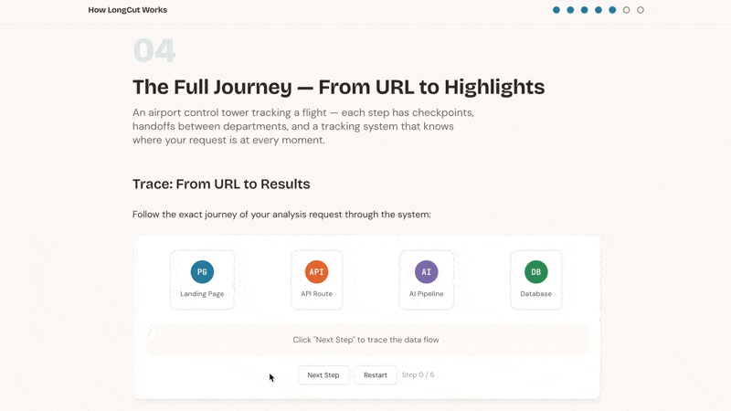
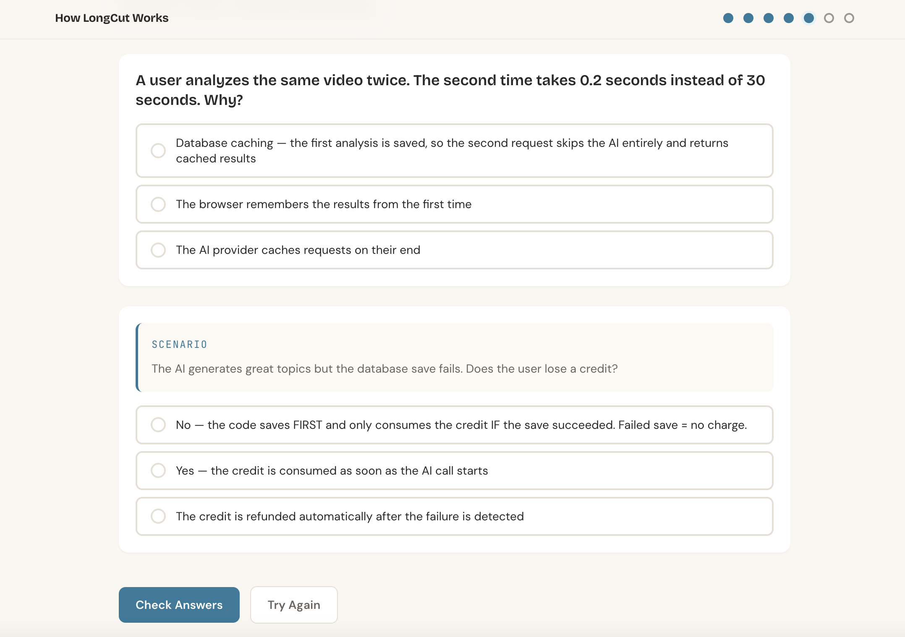
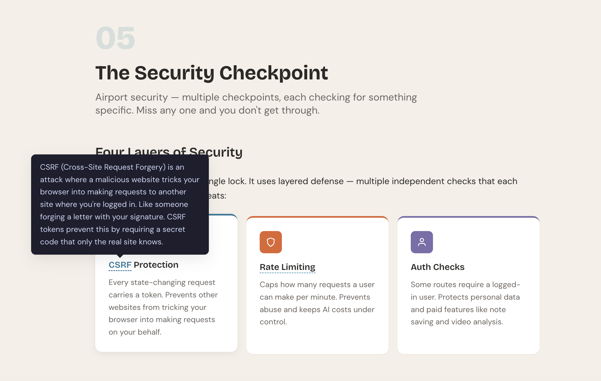

# Codebase to Course

A Claude Code skill that turns any codebase into a beautiful, interactive HTML course.

Point it at a repo. Get back a self-contained course directory that teaches how the code works — with scroll-based navigation, animated visualizations, embedded quizzes, and code-with-plain-English side-by-side translations. Open `index.html` in a browser with no setup required.

## Who is this for?

**"Vibe coders"** — people who build software by instructing AI coding tools in natural language, without a traditional CS education.

You've built something (or found something cool on GitHub). It works. But you don't really understand *how* it works under the hood. This skill generates a course that teaches you — not by lecturing, but by tracing what happens when you actually use the app.

**Your goals are practical, not academic:**
- Steer AI coding tools better (make smarter architectural decisions)
- Detect when AI is wrong (spot hallucinations, catch bad patterns)
- Debug when AI gets stuck (break out of bug loops)
- Talk to engineers without feeling lost

You're not trying to become a software engineer. You want coding as a superpower.

## What the course looks like

The output is a **directory** — open `index.html` directly in any browser, no server or build tool needed. It includes:

- **Scroll-based modules** with progress tracking and keyboard navigation
- **Code ↔ Plain English translations** — real code on the left, what it means on the right


- **Animated visualizations** — data flow animations, group chat between components, architecture diagrams


- **Interactive quizzes** that test *application* not memorization ("You want to add favorites — which files change?")


- **Glossary tooltips** — hover any technical term for a plain-English definition


  
- **Warm, distinctive design** — not the typical purple-gradient AI look

## How to use

### As a Claude Code skill

1. Copy the `codebase-to-course` folder into `~/.claude/skills/`
2. Open any project in Claude Code
3. Say: *"Turn this codebase into an interactive course"*

### Trigger phrases

- "Turn this into a course"
- "Explain this codebase interactively"
- "Make a course from this project"
- "Teach me how this code works"
- "Interactive tutorial from this code"

## Design philosophy

### Build first, understand later

This inverts traditional CS education. The old way: memorize concepts for years → eventually build something → finally see the point (most people quit before step 3). This way: **build something → experience it working → now understand how it works.**

### Show, don't tell

Every screen is at least 50% visual. Max 2-3 sentences per text block. If something can be a diagram, animation, or interactive element — it shouldn't be a paragraph.

### Quizzes test doing, not knowing

No "What does API stand for?" Instead: "A user reports stale data after switching pages. Where would you look first?" Quizzes test whether you can *use* what you learned to solve a new problem.

### No recycled metaphors

Each concept gets a metaphor that fits *that specific idea*. A database is a library with a card catalog. Auth is a bouncer checking IDs. API rate limiting is a nightclub with a capacity limit. Never the same metaphor twice.

### Original code only

Code snippets are exact copies from the real codebase — never modified or simplified. The learner should be able to open the actual file and see the same code they learned from.

## Skill structure

```
codebase-to-course/
├── SKILL.md                          # Main skill instructions
├── references/
│   ├── _base.html                    # Course shell template (title, nav, theme vars)
│   ├── _footer.html                  # Course closing tags
│   ├── build.sh                      # Assembles modules into index.html
│   ├── styles.css                    # Complete design system — copy verbatim, never edit
│   ├── main.js                       # All interactivity engines — copy verbatim, never edit
│   ├── content-philosophy.md         # Visual density rules, metaphor and quiz guidelines
│   ├── design-system.md              # CSS token reference and layout options
│   ├── gotchas.md                    # Common failure points checklist
│   ├── interactive-elements.md       # HTML patterns for every interactive element type
│   ├── module-brief-template.md      # Template for parallel-path module briefs
│   └── source-viewer-modal.md        # Inline modal for linking to external source files
└── assets/                           # Screenshots used in this README
```


---

Forked from [zarazhangrui/codebase-to-course](https://github.com/zarazhangrui/codebase-to-course).
